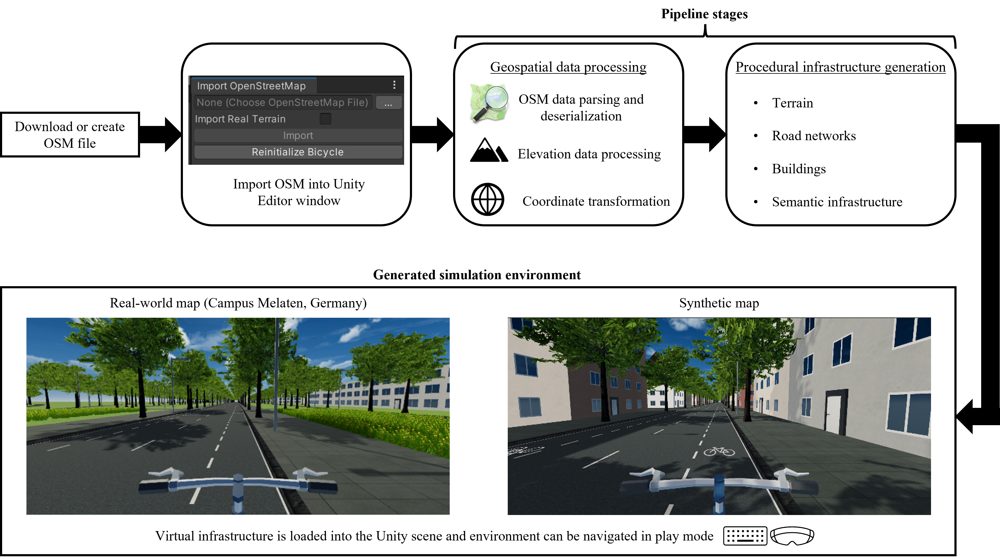

# OSM2Unity

## 🚴‍♂️ Bicycle Simulator Environment Generator (Unity + OSM)

This Unity package generates real-world and synthetic environments for a **bicycle simulator**, using **OpenStreetMap (.osm)** data and optional **realistic terrain** via `.asc` elevation files. It features a custom Unity Editor window for easy map import and infrastructure generation.



---

## 📌 Features

- 🗺️ **OSM Integration**  
  Procedurally builds roads, buildings, and terrain using `.osm` map data.

- 🌍 **Terrain Support**  
  Create either flat or real-world terrain from ASC elevation files with UTM conversion.

- 🌾 **Dynamic Grass Placement**  
  Grass is placed based on OSM `landuse` and polygon boundaries.

- 🛠️ **Editor Tool**  
  Import map files and generate scenes via a Unity Editor window (`Window → Import OpenStreetMap Data`).

- 🧱 **Modular Infrastructure System**  
  Easily extendable mesh pipeline for roads, buildings, etc.

- 🧠 **Tag-Aware OSM Parsing**  
  Understands traffic signs, cycleways, sidewalks, crossings, building types, and more.

---

## 🧰 How to Use

### Step 1: Import Package
#### Using Local Package

1. Download or clone the repository `https://github.com/rwth-irt/osm2unity`

2. Open Unity Package Manager:
```
Window → Package Manager → + → Add package from disk
```

3. Select `osm2unity/package.json`

#### Using Git URL

1. Open Unity Package Manager:
```
Window → Package Manager → + → Add package from git URL
```

2. Paste `https://github.com/rwth-irt/osm2unity.git`

### Step 2: Prepare Files

#### Real world maps
1. Go to [OpenStreetMap](https://www.openstreetmap.org/export).
2. Select the required region on map.
3. Export the `.osm` file in `xml` format.  
or  
Go to `Samples -> Maps` and choose one of the provided `.osm` examples.
#### Synthetic maps

Use the provided python script `generate_osm.py` in `Samples -> Maps` to generate synthetic road geometries:
- Straight roads
- Sinusoidal roads
- Circular roads

> ⚠️ Copy `Bicycle`,`EventSystem`, `Post-Processing Volume` and `WindZone` GameObjects from the provided Sample Scenes `CampusMelaten` or `StraightRoad` before importing map in a new Scene.

### Step 3: Use Editor Tool

1. Open Unity.
2. Go to `Window → Import OpenStreetMap Data`.
3. Select your `.osm` file.
4. (Optional) Enable `Import Real Terrain` to use elevation data.
5. Click **Import**.  

`Roads`, `Buildings` and `Terrain` GameObjects will be generated automatically in your current scene.

---

## 🚴 Bicycle Control Modes

### 1. 🕹️ **Keyboard Control (FreeRoam.cs)**

Activate the `FreeRoam.cs` script in the bike GameObject to enable manual control with terrain-aware alignment.

| Input         | Action                  |
|---------------|-------------------------|
| W/A/S/D       | Move forward/back/turn  |
| Shift         | Faster movement         |
| Mouse  | Free-look camera       |

### 2. 🧠 **VR Control (Vive Controller via OpenXR + SteamVR)**

1. Install [SteamVR](https://store.steampowered.com/app/250820/SteamVR/).
2. Connect your VR hardware.
3. Enable `ViveController.cs` script in the bike GameObject to control it using VR input from Vive or other OpenXR-compatible devices.

| Input         | Action                  |
|---------------|-------------------------|
| Right Trigger      | Analog Acceleration  |
| Left Trigger         | Analog Braking         |
| Trackpad x-axis | Analog Steering       |

---

## 📁 Project Structure
```plaintext
com.irt.osm2unity/
|── Editor/
|   ├── OpenStreetMapImporter/
|   |   ├── Infrastructure/
|   |   |   ├── Buildings/
|   |   |   |   ├── BuildingMaker.cs
|   |   |   |   ├── Roof.cs
|   |   |   |   └── Window.cs
|   |   |   |
|   |   |   ├── Roads/
|   |   |   |   ├── RoadMaker.cs
|   |   |   |   ├── Intersection.cs
|   |   |   |   ├── Lane.cs
|   |   |   |   └── Sidewalk.cs
|   |   |   |
|   |   |   ├── Semantic/
|   |   |   |   ├── ObjectPlacer.cs
|   |   |   |   ├── TrafficSign.cs
|   |   |   |   └── TrafficSignal.cs
|   |   |   |
|   |   |   ├── Terrain/
|   |   |   |   └── TerrainMaker.cs
|   |   |
|   |   ├── Deserialization/
|   |   |   ├── BaseOsm.cs
|   |   |   ├── OsmBounds.cs
|   |   |   ├── OsmNode.cs
|   |   |   ├── OsmRelation.cs
|   |   |   └── OsmWay.cs
|   |   |
|   |   ├── ImportMapDataEditorWindow.cs
|   |   ├── ImportMapWrapper.cs
|   |   ├── MapReader.cs
|   |   └── MercatorProjection.cs
|   |
|   ├── Bicycle/
|   |   └── Bicycle.cs
|
|── Runtime/
|   ├── FreeRoam.cs
|   └── ViveController.cs
```

---
## 🧪 Supported Tags

The following OSM tags are parsed and used in procedural generation:

| Element     | Tags Used                        | Description                        |
|-------------|----------------------------------|------------------------------------|
| Roads       | `highway`, `surface`, `lanes`, `sidewalk`    | Classifies cycleway, lanes, sidewalks, etc. |
| Buildings   | `building`, `building:levels`, `roof:shape`  | Controls height and type           |
| Terrain     | N/A                              | Optional ASC file for real elevation |
| Grass       | `landuse=grass`                  | Adds detail grass layer            |
| Signals     | `highway=traffic_signals`, `traffic_signals:direction` | Determines signal placement       |
| Signs     | `traffic_sign`, `highway=stop` | Determines traffic sign type and placement |

---

**Ride through a procedurally generated version of reality, powered by OpenStreetMap.**
